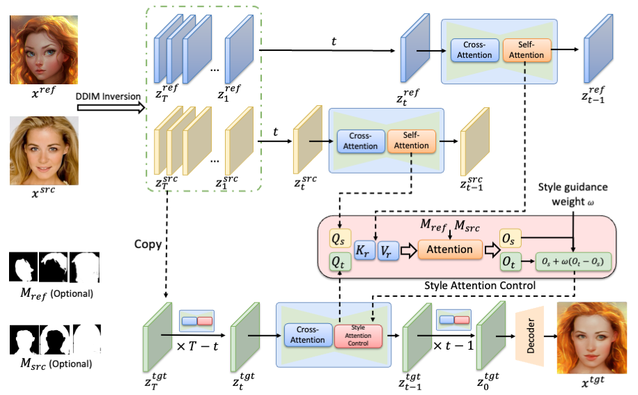

## Portrait Diffusion: Training-free Face Stylization with Chain-of-Painting
[Jin Liu](https://github.com/liujin112), [Huaibo Huang](https://scholar.google.com/citations?user=XMvLciUAAAAJ&hl=en&oi=sra), Chao Jin, [Ran He](https://scholar.google.com/citations?user=ayrg9AUAAAAJ&hl=en&oi=sra).

Pytorch implementation of [Portrait Diffusion: Training-free Face Stylization with Chain-of-Painting](https://arxiv.org/abs/)


[](https://arxiv.org/abs/2312.02212) 

---


## Introduction

This paper proposes a trainingfree face stylization framework, named Portrait Diffusion. This framework leverages off-the-shelf text-to-image diffusion models, eliminating the need for fine-tuning specific examples. Specifically, the content and style images are first inverted into latent codes. Then, during image reconstruction using the corresponding latent code, the content and style features in the attention space are delicately blended through a modified self-attention operation called Style Attention Control. Additionally, a Chain-of-Painting method is proposed for the gradual redrawing of unsatisfactory areas from rough adjustments to fine-tuning. Extensive experiments validate the effectiveness of our Portrait Diffusion method and demonstrate the superiority of Chain-ofPainting in achieving precise face stylization.



## To-do

- [x] Release the code.
- [ ] Chain-of-Painting
- [ ] Implementation for CFG>1
- [ ] SDXL Support
<!-- - [ ] Integrate with Webui -->

## Usage

### Requirements
We implement our method with [diffusers](https://github.com/huggingface/diffusers) code base with similar code structure to [MasaCtrl](https://github.com/TencentARC/MasaCtrl). The code runs on Python 3.9.17 with Pytorch 2.0.1.

```base
pip install -r requirements.txt
```

### Checkpoints

**Stable Diffusion:**
We mainly conduct expriemnts on Stable Diffusion v1-5. It can auto download by `diffusers` pipeline with `runwayml/stable-diffusion-v1-5`.

**Personalized Models:**
Our method also can work on various personalized models, includeing Full finetuned `ckpt` model, and PEFT model such as `LoRA`. You can download personlized models from [CIVITAI](https://civitai.com/) or train one by yourself.


### Inference
A simple inference code is provided as following, one can give the corresponding masks for content image and style image for better results. And set `--only_mask_region` to stylize the masked region only. A good result may need multiple `Chain-of-Painting` steps with different mask prompts.

```bash
export CUDA_VISIBLE_DEVICES=0
python main.py --step 0 \
              --layer 10 \
              --style_guidance 1.2 \
              --content 'images/content/1.jpg' \
              --content_mask '' \
              --style 'images/style/1.jpf' \
              --style_mask '' \
              --output './results' \

```


### Gradio Demo
Gradio demo provides more controllable settings. We intergrate [SegmentAnything Model (SAM)](https://github.com/facebookresearch/segment-anything) for obtaining the masks directly.

```bash
python app.py
```

For personalized model usage, you should place the full model to `models/Stable-diffusion` or LoRA model to `models/Lora`, and select them in the gradio demo.


## Acknowledgements
- Our implementation is mainly based on the structure of [MasaCtrl](https://github.com/TencentARC/MasaCtrl).


## Citation

```bibtex

```


## Contact

If you have any comments or questions, please [open a new issue](https://github.com/liujin112/PortraitDiffusion/issues/new/choose) or feel free to contact the authors.